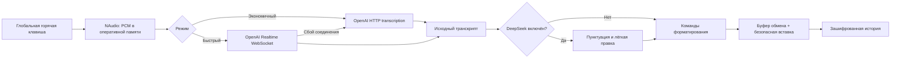

<p align="center">
  
</p>

<h1 align="center">pis.etc</h1>

<p align="center">
  <strong>Your personal amanuensis</strong><br>
  Фоновый Windows-диктовщик с оплатой только фактически использованных API.
</p>

> Это портфолио-проект с открытым для просмотра исходным кодом. Он не является
> официальным продуктом OpenAI или DeepSeek.

## Что умеет приложение

- записывает речь по глобальной горячей клавише;
- распознаёт русский текст с английскими терминами;
- по желанию исправляет пунктуацию, регистр, абзацы и явные повторы;
- вставляет готовый Unicode-текст обратно в исходное окно;
- показывает запись, уровень микрофона, обработку и результат поверх окон;
- работает из системного трея и поддерживает автозапуск;
- хранит ключи и историю средствами защиты Windows.

Основное управление:

- удерживать `Левый Ctrl + Левый Alt` — диктовать;
- отпустить любую из клавиш — закончить и вставить текст;
- `Левый Ctrl + Пробел` — переключить режим;
- `Esc` — отменить запись.

Горячие клавиши можно изменить в настройках.

## Скачать готовую программу

Для обычного использования откройте раздел
[Releases](../../releases/latest) и скачайте файл
`pis.etc-win10-x64-v1.1.1.zip`.

Архив, который GitHub автоматически предлагает через **Code → Download ZIP**,
содержит исходный код, а не готовую программу.

## Режимы

| Режим | Транспорт | Поведение |
|---|---|---|
| ₽ Экономичный | OpenAI HTTP API, `gpt-4o-mini-transcribe` | Распознавание после окончания записи |
| ⚡ Быстрый | OpenAI Realtime API, `gpt-live-transcribe`, WebSocket | Звук передаётся во время речи; при сбое приложение явно переключается в экономичный режим |

После распознавания текст может быть отправлен в `deepseek-v4-flash` для лёгкой
редакторской обработки. DeepSeek можно полностью отключить.

Переключение режима во время записи применяется к следующей диктовке.

## Как это работает



Аудио не записывается на диск. Перед началом диктовки приложение запоминает
активное окно и вставляет текст только в него. Если пользователь переключился в
другое окно, результат остаётся в буфере обмена и истории.

Подробное устройство проекта описано в
[`docs/ARCHITECTURE.md`](docs/ARCHITECTURE.md).

## Стек технологий

| Область | Технологии |
|---|---|
| Интерфейс | C#, WPF, .NET Framework 4.8 |
| Захват звука | NAudio 2.2.1, mono PCM 16/24 кГц |
| Распознавание | OpenAI HTTP API и Realtime WebSocket API |
| Постобработка | DeepSeek Chat Completions API |
| Интеграция с Windows | Win32 hooks, Clipboard, `SendInput`, системный трей |
| Защита данных | Windows Credential Manager, DPAPI CurrentUser |
| Автозапуск | `HKCU\Software\Microsoft\Windows\CurrentVersion\Run` |
| Проверка | Собственный набор автоматических тестов и GitHub Actions |

## Системные требования

| Требование | Значение |
|---|---|
| Официальная целевая система | Windows 10 x64 |
| Предполагаемая совместимость | Windows 11 x64; полная ручная проверка пока не проводилась |
| Среда выполнения | .NET Framework 4.8 |
| Оборудование | Рабочий микрофон; дискретная видеокарта не нужна |
| Сеть | Стабильный интернет с доступом к API выбранных провайдеров |
| Учётные записи | Собственный API-ключ OpenAI; ключ DeepSeek нужен только для постобработки |
| Права | Обычный пользователь Windows; права администратора не требуются |

Приложение выполняет распознавание в облаке, поэтому подходит и для сравнительно
слабых компьютеров. Скорость в основном зависит от сети, API и длительности
диктовки. Проектный ориентир — до 120 МБ оперативной памяти и менее 1% CPU в
простое.

Доступность API и отдельных моделей зависит от страны, аккаунта и действующих
правил провайдера. Пользователь самостоятельно оплачивает API-запросы по тарифам
OpenAI и DeepSeek.

## Быстрый старт

1. Скачайте portable ZIP из Releases.
2. Полностью распакуйте его в постоянную папку.
3. Запустите `SpeechToText.exe`.
4. Добавьте собственный ключ OpenAI на вкладке «API-ключи».
5. При необходимости добавьте ключ DeepSeek и включите постобработку.
6. Выберите микрофон, запустите трёхсекундную проверку и сохраните настройки.

Windows может показать SmartScreen, поскольку портфолио-сборка пока не имеет
платной цифровой подписи. Сверьте контрольную сумму релиза перед запуском.

Подробности: [`docs/FIRST_START.md`](docs/FIRST_START.md).

## Конфиденциальность

- ключи не находятся в исходном коде или конфигурационных файлах;
- ключи сохраняются в Диспетчере учётных данных Windows;
- аудио существует только в оперативной памяти и отправляется в OpenAI;
- распознанный текст отправляется в DeepSeek только при включённой обработке;
- последние 50 результатов защищены DPAPI текущего пользователя;
- приложение не создаёт технические логи с аудио, текстами или ключами;
- телеметрия и аналитика отсутствуют.

Полное описание границ данных и способа удаления локальной информации:
[`docs/PRIVACY.md`](docs/PRIVACY.md).

## Сборка из исходного кода

Понадобятся Visual Studio 2022, компонент **Desktop development with .NET** и
.NET Framework 4.8 Developer Pack.

```powershell
.\build-release.ps1
```

Скрипт восстанавливает NuGet-зависимости, собирает Release x64, запускает тесты
и создаёт portable ZIP в папке `artifacts`.

Подробная инструкция: [`docs/BUILDING.md`](docs/BUILDING.md).

## Структура репозитория

```text
src/SpeechToText.App/   WPF-интерфейс и интеграция с Windows
src/SpeechToText.Core/  распознавание, постобработка, модели и хранение
tests/                  автоматические тесты без реальных API-ключей
docs/                   архитектура, приватность и инструкции
.github/workflows/      автоматическая проверка сборки
```

## Ограничения

- Программа не может отправлять ввод в окно, запущенное от администратора, если
  сама работает без повышения прав.
- API-запросы требуют интернета, доступности сервиса и положительного баланса.
- Реальные API-тесты намеренно не выполняются в GitHub Actions: для них
  потребовались бы личные ключи и могли бы списываться средства.
- Текущая сборка не подписана сертификатом издателя.

## Лицензия

Исходный код опубликован для просмотра в рамках портфолио. По умолчанию права на
копирование, изменение и распространение не предоставляются — см.
[`LICENSE`](LICENSE). Сторонние компоненты перечислены в
[`THIRD-PARTY-NOTICES.md`](THIRD-PARTY-NOTICES.md).
