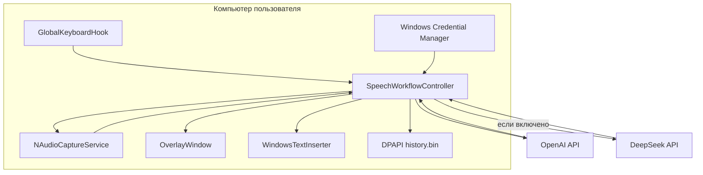

# Архитектура

## Общая схема

`pis.etc` — фоновое WPF-приложение без собственного сервера. Оно напрямую
подключается к API распознавания и постобработки, а локально выполняет только
захват звука, управление состояниями, интерфейс и вставку текста.



## Проекты решения

### `SpeechToText.App`

WPF-интерфейс и интеграция с Windows:

- глобальный низкоуровневый клавиатурный hook;
- захват устройств и звука через NAudio;
- окно настроек, неактивируемая панель и системный трей;
- вставка через Unicode-буфер обмена и Win32 `SendInput`;
- Windows Credential Manager;
- управляемый автозапуск через HKCU;
- запрет второго экземпляра.

### `SpeechToText.Core`

Независимая логика:

- контракты провайдеров и сервисов;
- HTTP-распознавание OpenAI;
- Realtime-сессия через `ClientWebSocket`, специализированный endpoint
  `?intent=transcription` и `gpt-live-transcribe`;
- постобработка DeepSeek;
- команды форматирования;
- автомат состояний;
- настройки и зашифрованная история.

### `SpeechToText.Tests`

Консольный набор тестов без стороннего тестового фреймворка. HTTP-вызовы
подменяются локальными обработчиками. Реальные API-запросы не выполняются.

## Жизненный цикл диктовки

```text
Idle → Recording → Transcribing → Editing → Inserting → Completed
                                             ↘ Error / Cancelled
```

1. Нажатие горячей клавиши сохраняет дескриптор активного окна.
2. NAudio начинает собирать mono PCM одновременно в форматах 16 и 24 кГц.
3. Экономичный режим после отпускания клавиш отправляет WAV через HTTP.
4. Быстрый режим начинает специализированную transcription WebSocket-сессию
   вместе с записью, ожидает событие `session.updated` и вручную фиксирует
   буфер после отпускания клавиш.
5. При сбое Realtime используется сохранённое в памяти аудио и пакетное
   распознавание; интерфейс переключается в экономичный режим, а история
   помечает резервный путь.
6. Команды форматирования применяются локально. Если включён DeepSeek,
   транскрипт предварительно проходит лёгкую редактуру.
7. Текст копируется в буфер и вставляется только при сохранении исходного
   активного окна.
8. Метаданные и оба варианта текста добавляются в защищённую историю.

## Границы доверия

- OpenAI получает аудио и словарь терминов.
- DeepSeek получает только распознанный текст и словарь, причём лишь когда
  постобработка включена.
- API-ключи передаются соответствующему провайдеру в заголовке авторизации.
- На GitHub Actions реальные ключи не нужны и не используются.
- Аудио на диск не записывается.

Подробности приведены в [`PRIVACY.md`](PRIVACY.md).
